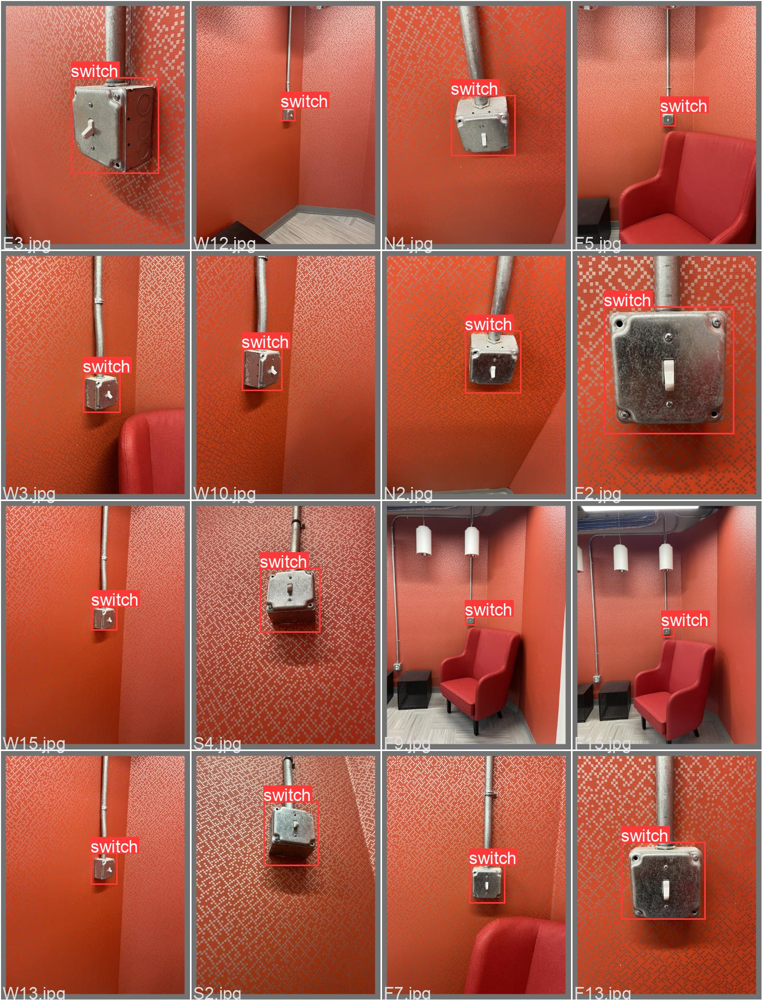
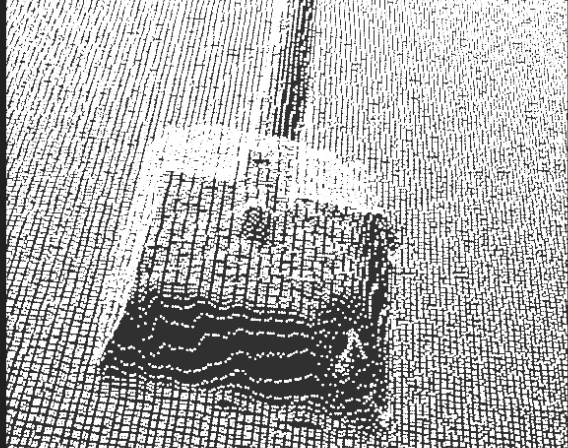

# FRI_Lightswitch

Used an object recognition model (YOLOv5) paired with Azure Kinect color and depth camera to recognize and create an image segmentation of a light switch. 

Would eventually like to pair this to a robotic arm (Universal Robot UR5) to flip the light switch on command. 

        
        
Batch of labeled images.

         
        
3D reconstruction of lightswitch in pointcloud.

xfun::embed_file("presentation.pdf")

<object data="presentation.pdf" type="application/pdf" width="700px" height="700px">
    <embed src="presentation.pdf">
        
This browser does not support PDFs. Please download the PDF to view it: <a href="presentation.pdf">Download PDF</a>.

    </embed>
</object>